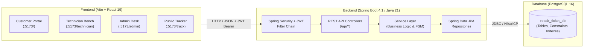

# OmniFix | Smart Repair Ticket Management System


**OmniFix** is a full-stack, enterprise-grade hardware repair ticket and workshop management platform. Designed for hardware service centers, repair depots, and technical service hubs, OmniFix connects clients, bench specialists, and operations managers through an end-to-end service lifecycle:

$$\textbf{Customer} \longrightarrow \textbf{Device} \longrightarrow \textbf{Repair Request} \longrightarrow \textbf{Diagnosis} \longrightarrow \textbf{Repair} \longrightarrow \textbf{Quality Check (QA)} \longrightarrow \textbf{Handover / Pickup}$$

---

## Key Features & Role Portals

### 1. Customer Client Portal (`/`)
- **Actionable Customer Dashboard**: Live summary metrics (*Active Repairs*, *Ready for Pickup*, *Completed Repairs*, *Registered Devices*) with instant filter chips.
- **"My Repairs" Table**: Clean, high-density tabular view with ticket codes, device icons, reported symptoms, status pills, SLA turnaround dates, and quick actions (`View Repair`, `Track`, `Cancel`).
- **Guided 4-Step "Book a Repair" Flow**: Step-by-step hardware selection, symptom classification with contextual prompts, turnaround SLA tier selection (*Standard*, *Expedited*, *Urgent*, *Emergency 24h*), and printable pre-flight receipt.
- **Hardware Asset Fleet Management**: Manage registered laptops, phones, tablets, and desktops with copyable serial numbers, live service status pills, and 1-click booking.

### 2. Workshop Specialist Bench (`/technician`)
- **Authorized Workshop Terminal**: Secure, authenticated bench portal.
- **Available Pool**: Unassigned repair requests ready for bench specialists to inspect and claim.
- **Active on Bench**: Dedicated workspace displaying claimed hardware units with direct **"Decide Progress Level"** quick actions (`Start Bench Repair`, `Mark QA Complete`, `Pause / Revert`) and interactive status selectors.
- **Diagnostic Timeline Logging**: Append detailed technical bench notes, test results, and component replacements.

### 3. Master Operations & Admin Desk (`/admin`)
- **Operations Command Center**: Real-time KPI metrics (*Total In Queue*, *Pending Intake*, *Active On Bench*, *Ready For Pickup*).
- **Attention Required Triage**: Bottleneck detection for *Needs Assignment*, *Overdue / SLA Alerts*, *In Bench Repair*, and *Ready for Pickup*.
- **Bench Capacity & Workload**: Real-time specialist bench capacity tracking (utilization bars, active ticket count, QA count).
- **Dual Workspace Modes**: Toggle between **9-Column Table View** and **5-Stage Kanban Board** (`Intake`, `Assigned`, `Bench Repair`, `Quality Check`, `Collected / Dispatched`).
- **Deep 5-Tab Service Desk Modal**: Comprehensive inspection covering Overview, Diagnostic Notes Feed, Workflow FSM Transitions, Hardware Specifications, and Immutable Activity Timeline.
- **Technician Roster Management**: Onboard technicians with auto-generated credentials, specialize skills, and decommission staff safely.

### 4. Public Live Service Tracker (`/track`)
- **Public Zero-Login Tracking**: Real-time search by Ticket Code (`TICK-YYYYMMDD-XXXXXXXX`).
- **6-Milestone Progress Stepper**: Linear customer mental model with completed checkmarks, active pulsating milestone, and percentage completion.
- **"Latest Service Update" Callout**: High-visibility card highlighting the most recent diagnostic update, technician note, timestamp, and estimated completion date.
- **Privacy Masking**: Automatically masks client names and device serial numbers for public tracking privacy.

---

## System Architecture



---

## Tech Stack

| Layer | Technologies |
|---|---|
| **Frontend** | React 19, Vite 8, Modern Vanilla CSS Design System, Responsive Layouts |
| **Backend** | Java 21, Spring Boot 4.1.1, Spring Security, Spring Data JPA, Hibernate, Maven |
| **Authentication** | Stateless JWT (HMAC-SHA256), Role-Based Access Control (`ROLE_ADMIN`, `ROLE_TECHNICIAN`, `ROLE_USER`) |
| **Database** | PostgreSQL 15/16 with HikariCP Connection Pooling |
| **Containerization** | Docker, Docker Compose |

---

## Quick Start & Local Setup

### Prerequisites
- **Java Development Kit (JDK)**: Version 21 or higher
- **Node.js**: Version 18.x or higher (npm included)
- **PostgreSQL**: Version 15+ (or Docker)

---

### Step 1: Database Setup

#### Option A: Using Docker (Recommended)
From the project root, run:
```bash
docker compose up -d
```
This spins up a pre-configured PostgreSQL container on port `5432` with database `repair_ticket_db`.

#### Option B: Native PostgreSQL
Ensure PostgreSQL is running locally on port `5432`, then create the database:
```sql
CREATE DATABASE repair_ticket_db;
```

---

### Step 2: Backend Setup

1. Navigate to the backend directory:
   ```bash
   cd repair-ticket-backend
   ```
2. (Optional) Copy `.env.example` to configure custom database credentials or ports:
   ```bash
   cp .env.example .env
   ```
3. Run the Spring Boot application using the Maven wrapper:
   - **Windows**:
     ```powershell
     .\mvnw.cmd spring-boot:run
     ```
   - **Linux / macOS**:
     ```bash
     ./mvnw spring-boot:run
     ```
4. The backend service will start on `http://localhost:8082`.

---

### Step 3: Frontend Setup

1. Navigate to the frontend directory:
   ```bash
   cd repair-ticket-frontend
   ```
2. Install dependencies:
   ```bash
   npm install
   ```
3. Launch the development server:
   ```bash
   npm run dev
   ```
4. Access the web application at [http://localhost:5173](http://localhost:5173).

---

## Verified Default Credentials

| Portal | URL | Username | Password | Role |
|---|---|---|---|---|
| **Customer Client Portal** | `http://localhost:5173/` | `alexmercer` | `Client@OmniFix2026!` | `ROLE_USER` |
| **Workshop Specialist Bench** | `http://localhost:5173/technician` | `tech_marcus_vance` | `Tech@OmniFix2026!` | `ROLE_TECHNICIAN` |
| **Master Operations & Admin Desk** | `http://localhost:5173/admin` | `admin` | `Admin@OmniFix2026!` | `ROLE_ADMIN` |
| **Public Live Service Tracker** | `http://localhost:5173/track` | *(Public)* | *(No auth required)* | Public Visitor |

> [!NOTE]
> Customers can also self-register 24/7 directly from the Customer Sign-In page (`/`).

---

## Key REST API Endpoints

### Authentication (`/api/auth`)
| Method | Endpoint | Description | Access |
|---|---|---|---|
| `POST` | `/api/auth/login` | Authenticate user & return JWT token | Public |
| `POST` | `/api/auth/register` | Customer self-registration (`ROLE_USER`) | Public |

### Repair Tickets (`/api/tickets`)
| Method | Endpoint | Description | Access |
|---|---|---|---|
| `GET` | `/api/tickets` | Paginated ticket queue with search & filters | Admin, Technician |
| `POST` | `/api/tickets` | Intake new hardware repair ticket | Authenticated |
| `GET` | `/api/tickets/{id}` | Get ticket details by ID | Authenticated |
| `GET` | `/api/tickets/number/{ticketNumber}` | Public ticket lookup by ticket code | Public |
| `PATCH` | `/api/tickets/{id}/status` | Advance lifecycle status in FSM | Admin, Technician |
| `POST` | `/api/tickets/{id}/assign` | Assign/claim specialist to ticket | Admin, Technician |
| `POST` | `/api/tickets/{id}/cancel` | Cancel unserviced repair ticket with reason | Admin, User |
| `GET` | `/api/tickets/customer/{id}` | Retrieve tickets belonging to a customer | Authenticated |
| `GET` | `/api/tickets/{id}/updates` | Retrieve ticket diagnostic update feed | Authenticated |
| `GET` | `/api/tickets/number/{num}/updates` | Public diagnostic update feed | Public |

### Hardware Devices & Customers (`/api/devices`, `/api/customers`)
| Method | Endpoint | Description | Access |
|---|---|---|---|
| `GET` | `/api/devices/customer/{id}` | List hardware units owned by customer | Authenticated |
| `POST` | `/api/devices` | Register new hardware unit | Authenticated |
| `GET` | `/api/customers` | Query customer CRM list | Admin |
| `POST` | `/api/customers` | Register customer CRM record | Authenticated |

---

## Project Structure

```
repair-ticket/
├── .gitignore                   # Unified root git ignore
├── docker-compose.yml           # PostgreSQL Docker service
├── README.md                    # Repository documentation
├── repair-ticket-backend/       # Spring Boot 4.1 REST API
│   ├── .env.example             # Environment template
│   ├── pom.xml                  # Maven dependencies & build plugins
│   ├── src/
│   │   ├── main/
│   │   │   ├── java/com/bharath/repairticket/
│   │   │   │   ├── config/      # SecurityConfig, CorsConfig
│   │   │   │   ├── controller/  # REST Endpoints
│   │   │   │   ├── dto/         # Request / Response Models
│   │   │   │   ├── entity/      # JPA Entities (Ticket, Device, Customer, User)
│   │   │   │   ├── exception/   # Global Exception Handling
│   │   │   │   ├── repository/  # Spring Data JPA Repositories
│   │   │   │   ├── security/    # JwtAuthenticationFilter, JwtTokenProvider
│   │   │   │   └── service/     # Business Logic & Workflows
│   │   │   └── resources/
│   │   │       └── application.properties # Configuration
│   └── mvnw.cmd / mvnw          # Maven wrappers
└── repair-ticket-frontend/      # React 19 + Vite 8 SPA
    ├── package.json             # NPM dependencies & scripts
    ├── vite.config.js           # Vite dev server & API proxy
    ├── src/
    │   ├── components/          # Portal views (Customer, Technician, Admin, Tracker)
    │   │   ├── common/          # Reusable UI primitives (StatCard, Table, Stepper)
    │   │   ├── layout/          # Topbar, Sidebar, PageHeader
    │   │   └── tickets/         # AttentionRequired, Workload, Kanban
    │   ├── context/             # AuthContext, ToastContext
    │   └── services/            # Centralized API service client
```

---

## License

This project is licensed under the [MIT License](LICENSE).
